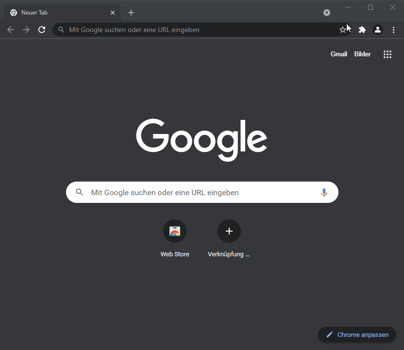
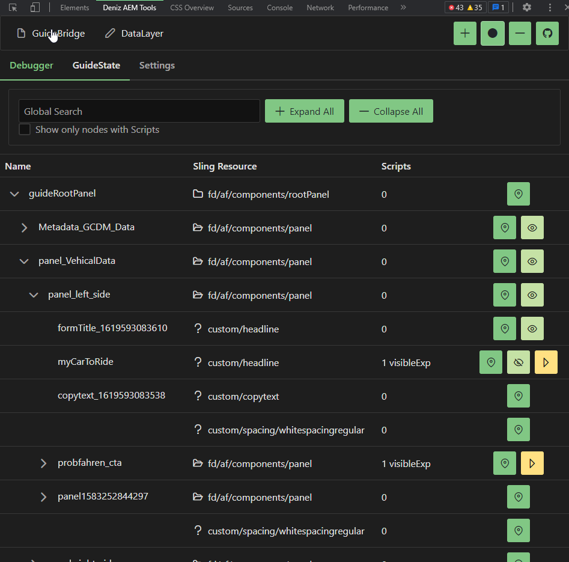
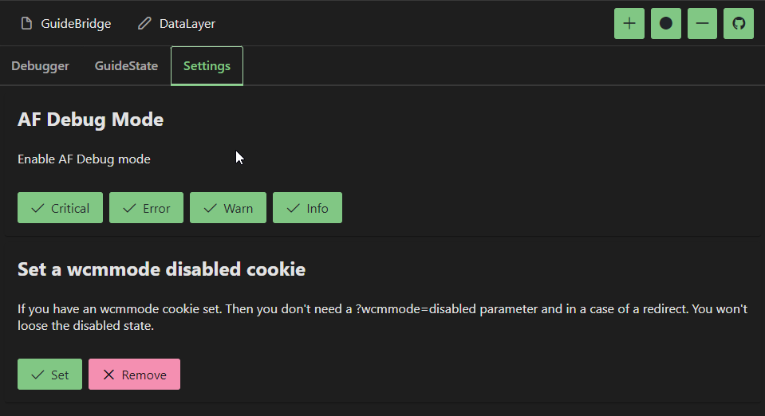

    

# DADT

A alternative to [AEM Chrome Plug-in](https://chrome.google.com/webstore/detail/aem-chrome-plug-in/ejdcnikffjleeffpigekhccpepplaode?hl=de)

## Installation

Download the production zip (aem-dev-tools-{version}-production.zip) from the release tab. And add the extracted folder as unpacked extension into chrome.

## Screenshots

## Documentation

Soon

## Roadmap

- Additional browser support(FireFox)
- More functions for guideBridge
- Terminal with debug functions (Favorite and Bookmark)

## Acknowledgements

- [vue-cli-plugin-browser-extension](https://github.com/adambullmer/vue-cli-plugin-browser-extension)
- [vuejs v3](https://v3.vuejs.org/)
- [Primevue](https://www.primefaces.org/primevue/)

## Authors

- [@Deniz Hofmann](https://github.com/TetrisBlack)
